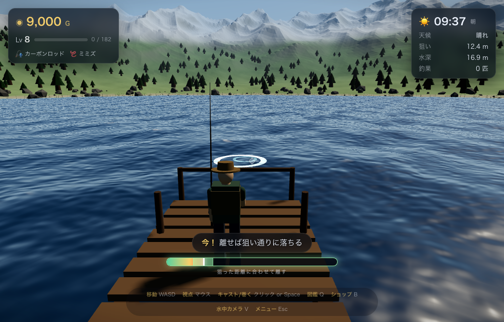
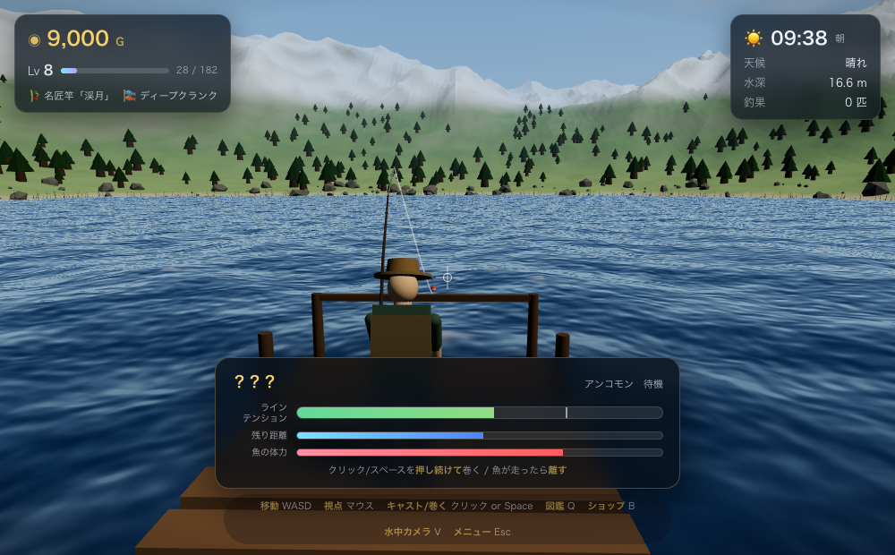

# 湖畔のフィッシング
### Lakeside Fishing

**朝焼けの湖で、静かに糸を垂れる。**  
深場には *湖の主* が眠っているという。

### ▶ [ブラウザで遊ぶ](https://lakeside-fishing.teitasan.workers.dev/)

インストール不要・ブラウザだけで完結。音が出ます。PC + マウス推奨。  
**日本語 / English** 両対応。タイトルから **みんなで遊ぶ** で同じ湖に入れます。


<p>


</p>
<p>


</p>

---

## どんなゲーム？

湖畔を歩き、タナとエサを選び、キャストして待つ——静かな釣りを軸にした 3D フィッシングゲームです。

- **狙って投げる** — 見下ろすと近く、水平にすると遠く。緑の帯で離せば狙い通り
- **場所と層が命** — 浅場・深場、表層・中層・底層。魚ごとに居場所が違う
- **ファイトは竿と音で** — 張って巻く、走ったら送る。跳ね・首振りにも反応
- **図鑑と測量** — 魚と地形を集め、歩いた／投げた所だけ湖が地図になる
- **毎回ちがう湖** — シード生成。昼夜・天候で釣れる魚も変わる
- **道具を育てる** — ロッド・ライン・エサ。レベルで上位が解禁

| | |
| --- | --- |
| 魚・生きもの | 30 種 + ゴミ 4 種 |
| 装備 | ロッド 5 / ライン 9 / エサ 7 |
| 実績 | 9 |
| 視点 | 一人称・水中カメラ |
| 対応言語 | 日本語 / English |

---

## 遊び方（ひと息）

1. **マウスで狙う** → 長押しして緑の帯で離す（キャスト）
2. **`E`** でタナ（表層 / 中層 / 底層）を選ぶ
3. ウキが沈んだら **すぐにクリック**（アワセ）
4. ヒット後は **押し続けて巻く** / **離してテンションを抜く**
5. 釣果でお金と経験値。`B` でショップ、`Q` で図鑑

詳しいパラメータやシミュレータは [パラメータ解説](https://teitasan.github.io/lakeside-fishing/manual.html) へ。

---

## 操作

| | |
| --- | --- |
| 視点 | マウス（クリックでロック / Esc で解除） |
| 移動 / ダッシュ | `W` `A` `S` `D` / `Shift` |
| キャスト・アワセ・巻く | クリック or `Space` |
| タナ | `E` |
| 図鑑 / ショップ / マップ | `Q` / `B` / `M` |
| 水中カメラ | `V`（仕掛けが水中のとき） |
| 表示切替 / メニュー | `U` / `Esc` |

言語はタイトル画面またはメニューから切り替えできます。

---

## ヒント

- 水深とタナを合わせる。`E` の画面に「ここで食いつく魚」が出る
- 大物は道具不足だとラインが切れる。ライン＝強度、ロッド＝巻きと粘り
- 夜・雨・深場・高級エサ。噂の **湖の主** と **イトウ** はそこにある
- メニューの「ひと休み」で 1 時間進められる

---

## ローカルで動かす

```bash
./serve.sh
# または: python3 -m http.server 8000
```

`http://localhost:8000` を開く。`file://` では動きません。WebGL2 対応ブラウザ推奨。

---

## クレジット

- 釣り人・竿モデル: [Quaternius](https://quaternius.com/)（CC0）
- エンジン: Three.js（リポジトリ内に同梱・外部通信なし）

Cloudflare Workers で配信中 → [lakeside-fishing.teitasan.workers.dev](https://lakeside-fishing.teitasan.workers.dev/)  
（旧 GitHub Pages: [teitasan.github.io/lakeside-fishing](https://teitasan.github.io/lakeside-fishing/)）
