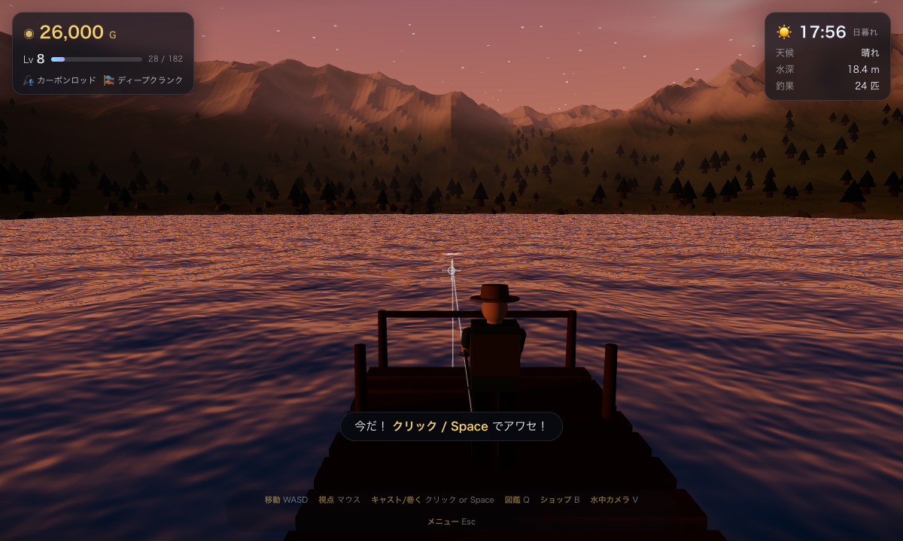
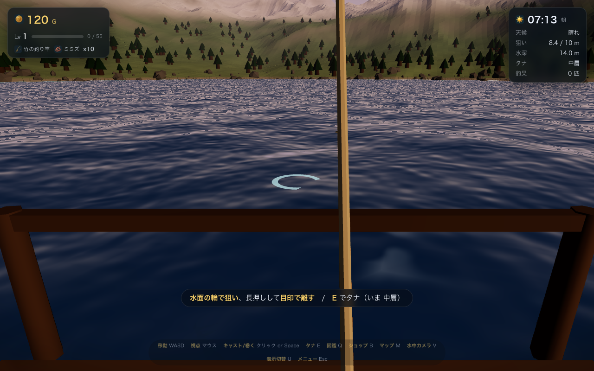
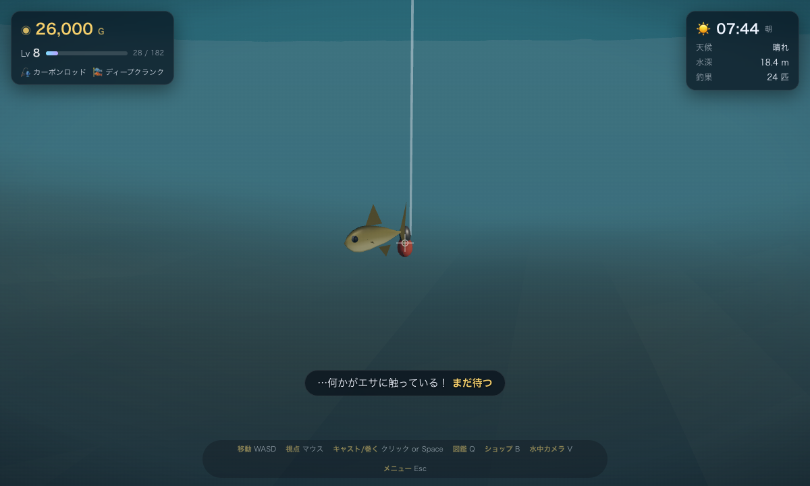
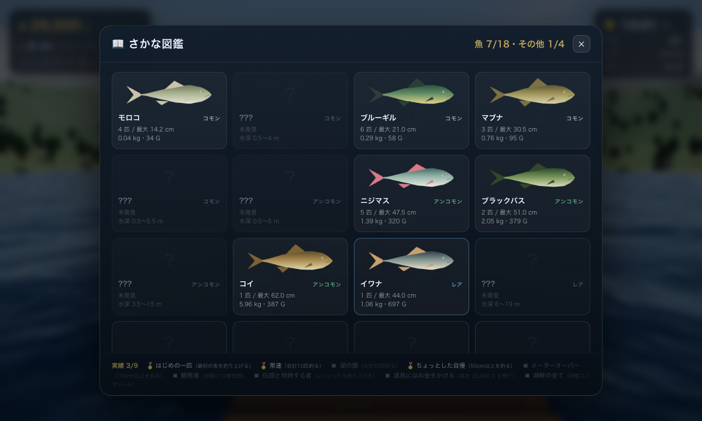

# 湖畔のフィッシング — Lakeside Fishing

### ▶ **[ブラウザで遊ぶ（GitHub Pages）](https://teitasan.github.io/lakeside-fishing/)**　|　📐 **[パラメータ解説](https://teitasan.github.io/lakeside-fishing/manual.html)**

Three.js だけで作った、ブラウザで完結する 3D 釣りゲームです。
外部アセット・外部通信は一切なし（three.js もリポジトリ内に同梱）。
インストール不要、リンクを開くだけで遊べます（**音が出ます** 🔊 / PC + マウス推奨）。



<p>



</p>

## ローカルで動かす

公開版は上のリンクから遊べます。手元で動かす場合、ES Modules を使うので
`file://` では動きません。ローカルサーバー経由で開いてください。

```bash
cd "Fishing Game"

# どれか1つ
python3 -m http.server 8000     # → http://localhost:8000
npx serve .                      # Node がある場合
./serve.sh                       # 同梱の起動スクリプト（python3 を使用）
```

ブラウザで `http://localhost:8000` を開き、「釣りをはじめる」を押してください。
WebGL2 対応ブラウザ（Chrome / Edge / Firefox / Safari の最新版）推奨。**音が出ます。**

## 操作

| 操作 | キー |
| --- | --- |
| 視点 | マウス（初回クリックでマウスロック。Esc で解除／ロックできない環境では**右ドラッグ**） |
| 移動 / ダッシュ | `W` `A` `S` `D` / `Shift` |
| 狙い | マウス（見下ろすと近く／水平で遠く。水面の輪が狙い点） |
| タナ（狙う層） | `E` で仕掛けウインドウ → **表層 / 中層 / 底層** をクリック（キャスト前のみ） |
| キャスト | 左クリック or `Space` を**長押し**し、メーターの**緑の帯**で離す |
| アワセ（フッキング） | ウキが沈んだ瞬間に 左クリック or `Space` |
| 巻き上げ | 左クリック or `Space` を**押し続ける**（離すとテンションが抜ける） |
| 仕掛けの回収 | アタリ待ち中に 左クリック |
| 図鑑 | `Q` |
| ショップ | `B` |
| 水中カメラ | `V`（仕掛けが水中にある時）／**マウスで見回す・ホイールで寄り引き** |
| 図鑑 | `Q`（**さかな** / **地形** の 2 タブ） |
| カメラ距離 / 一人称 | マウスホイール（一番手前まで回すと**一人称視点**、奥へ回すと三人称に戻る） |
| マップ（測量図） | `M`（歩いた所と投げた所だけ地形が分かる） |
| メニュー | `Esc` |
| デバッグ表示 | `F3`（または メニュー内のチェックボックス） |

## ゲームの流れ

1. **キャスト**：まず**マウスで狙う**（見下ろすほど近く、水平にするほど遠く。水面の輪が狙い点）。
   長押しするとメーターに**その距離に必要なパワーの位置＝緑の帯**が出るので、そこで離すと**狙い通りに着水**します
   （＝魚を驚かせにくい／アタリが早い）。外すと手前に落ちたり飛ばし過ぎたりします。
   HUD に**狙い距離とその地点の水深**が出るので、投げる前にポイントを下見できます。**足元 5m から 50m まで**同じ操作で狙えます。
   桟橋・陸の張り出し・岩を挟む向きだと**リングが赤くなって警告**が出ます。そのまま投げると糸が掛かって回収になります。
2. **タナを決める**：`E` で仕掛けウインドウを開き、**表層 / 中層 / 底層** の 3 つから選びます（エサの種類とは独立）。
   実際の深さは**着水地点の水深の比率**（15% / 50% / 88%）で自動的に決まるので、浅場でも深場でも同じ感覚で使えます。
   魚には **①生息水深**（その魚が居る場所の水深）と **②遊泳層**（水中のどの層で食うか）があり、
   **両方が合ったときだけ釣れます**。たとえばドジョウは浅場の底の魚なので、
   水深 20m ではどの層でも来ませんし、浅場でも表層にはほとんど出ません（底層の 1/6 以下）。
   逆に藻場のライギョは浅場でも**表層**で食います。ウインドウには**その場所・その層で食いつく魚**が出ます（未発見は `??? ×n`）。
   **底層はゴミも増えます**（×1.5）。**キャスト後は変更できません**（回収してから結び直す）。
3. **待つ**：水深と魚の生息層とタナが合うほどアタリが出やすい。
   魚が近づくと「何かが寄ってきた」と表示。`V` の水中カメラで実際に泳いでくる魚が見られます。
4. **アワセ**：ウキがククッと沈み `!` が出た瞬間にボタン。遅れると逃げられます（レア魚ほど早い）。
   **逃げられると 8 割の確率でエサを取られます**（残り 2 割は無事で、そのまま待てます）。取られたら針が空なので自動で回収されます。
5. **ファイト**：押し続けて巻く／テンションが上がったら離して糸を送る（**跳ねた・首を振った**ときは必ず離す）。
   巻き取りには**立ち上がり**があり（0.22 秒で 63%・0.66 秒で 95%）、**細かい連打は空回り**します（乗りは 30% 前後で止まる）。
   糸は**魚の口**に付き、**ウキは糸が水面と交わる位置**に乗ります。
   引きの強い魚は長く押せない＝乗り切らないので、ここが装備の壁として効きます。
   **魚種とレア度は取り込むまで分かりません**（表示されるのは「引きの強さ」と「ファイトの型」だけ）。
   魚種ごとに**4つのファイトの型**が割り当てられており、同じメーターでも戦い方が変わります。

   | 型 | 体感 | 対応 |
   | --- | --- | --- |
   | スプリンター | 短い突進を何度も繰り返す | 離すタイミングの反復 |
   | 重量級 | 走りは稀だが常に重く、糸が抜けにくい | 長く安全帯を維持する |
   | ジャンパー | 走りの途中で水面に跳ねる | 跳ねている間に送れれば魚が消耗する |
   | 首振り | 小刻みに首を振り、その間は巻いても進まない | 振っている間は手を止める |
   - **ラインテンション**が振り切れる → ラインブレイク
   - **残り距離**が振り切れる → 走り切られて逃走（掛けた地点から **16m** 走られたら逃走。バーの上限も「掛けた距離＋16m」なので、**近くに掛ければ寄せる距離も短い**）
   - テンションを掛け続けると**魚の体力**が減り、寄せやすくなります。
6. **釣果**：全長・重さ・買値・経験値が出て、お金と図鑑に反映されます。レベルが上がると上位の道具が解禁。

## パラメータ解説ページ

内部の計算式と全パラメータを解説した [manual.html](https://teitasan.github.io/lakeside-fishing/manual.html) を同梱しています。

- 「魚の体力」「糸の強さ」など 4 つのメーターの正体と、ファイトの完全な更新式
- **ファイト・シミュレータ**：魚種 × ロッド × ライン × 操作の丁寧さ を指定して、取込率／ライン切れ率／所要時間を 200 回試行で計算（テンション推移グラフ付き）
- **アタリ抽選シミュレータ**：水深・時刻・天候・エサ・レベルを指定して、どの魚が何％で食いつくかを重みの内訳付きで表示
- 魚 34 種・装備 17 種の全パラメータ表（ゲーム本体の `src/data.js` を読み込んで生成するため常に実装と一致）

## 攻略のヒント

- 湖は**方角ごとに斜面の緩急が変わります**。広い浅棚が続く岸と、岸からすぐ落ちる急斜面が同じ湖に混在し、途中に**かけあがり**（最大 5.8m の段差）が入ります。桟橋の先端は水深 6〜19m、遠投でさらに深場へ。**藻場**（水深 2.5m 前後）にはライギョ、桟橋の斜め前 20〜40m の**深い淵**（水深 24m 前後）には大物。
- **湖底は「棚とかけあがりの階段」**：深さを「なめらかな斜面 30〜40%」＋「2〜4 段の落ち込み」に分けて作るので、
  **平らな棚**と**急なかけあがり**が交互に現れます（例：1.2m の棚 8m → 6m で 5.8m 落ちる → 7.5m の棚 12m）。
- **深い淵は平均 2.5 か所、浅い平場は平均 3.5 か所**（1 つ目は桟橋から狙える所に必ず確保）。1 つだけだと何もない水域が広すぎるため
- **水中ストラクチャー**（沈み岩・立ち枯れ）が 16〜23 個。水面には出ないのでキャストの邪魔にはならず、**肉食魚・藻場の魚 ×1.45／底物 ×1.3** の集魚効果があります（`V` の水中カメラで見えます）。桟橋から狙える所に必ず 2 個以上あります。
- **水底は 砂地／岩場／泥底**。底を釣るときだけ強く効きます（岩場＝バス・ライギョ・鱒、泥底＝コイ科と底物、砂地＝底物と深場）。`E` の仕掛けウインドウに「砂地 ＋立ち枯れ」のように出ます。
  **岩場には転石がゴロゴロ**（最大 2400 個）散らばるので、水中カメラで覗けば底質が目で分かります。
- 湖は**シードから毎回生成**されます。ポーズ画面（Esc）に今の湖の情報（桟橋の水深・淵と藻場の方角と距離）が出るので、それを見て回るのが早いです。
- HUD の水深と図鑑の「水深 ○〜○ m・底層」表示を見て、**場所と層を合わせる**のが基本（`E` のウインドウに「ここで食いつく魚」が出ます）。エサはその魚の好みで選びます。
- **時間帯**と**天候**で釣れる魚が変わります（夜のナマズ、雨のウグイ、夜明けのヤマメ／イワナ…）。
  雨はアタリが増えます。時間はメニューの「ひと休み」で 1 時間進められます。
- **時間帯で釣れる「深さ」も変わります**（日周移動）。ワカサギは昼は底・朝夕〜夜は表層、
  ナマズ・ウナギ・コイ・エビは夜に浅場へ差し、鱒とバスは朝夕に浮いて日中は深い層へ。
  ライギョだけは逆で**日中に水面**。図鑑に「🕒 日中は深く・朝夕は浅く」と出るので、それを見て層と場所を選びます。
- 大物は道具が足りないと即ラインブレイク。**ライン**は強度、**ロッド**は巻き取りと粘りに効きます。
- **エピック（チョウザメ・アリゲーターガー・イトウ）はレベルが足りなくても極低確率で掛かります**
  （深場・夜ほど高く、Lv1 の淵で 100 回に 1 回ほど）。獲れるかは道具次第。
  **湖の主・白龍魚**だけはレベル解禁（Lv6〜11）が必要です。
- 深い淵で夜・雨、そして高級エサ。**湖の主**が眠っているという噂です。

## 収録内容

- 魚・生きもの 30 種（コモン〜レジェンド。エビ・ザリガニ・カニも）＋ ゴミ 4 種 / 図鑑・自己記録・実績 9 種
- **湖の測量図**（`M`）：440m 四方を 72×72 の格子（1 マス 6.1m）で持ち、**歩いた所（半径 14m）と仕掛けを落とした所（半径 18m）だけ**
  水深・底質・見つけた淵／平場／ストラクチャーが地図に出ます。測量率も表示。湖（シード）を変えると白紙に戻ります
- **地形図鑑 14 種**：初めてそこに投げた瞬間に登録されます（水深帯 3・底質 3・地形 5・ストラクチャー 3）。
  1 回のキャストで複数まとめて埋まることもあり、その場所で釣れた魚も記録されます。断面図つき
- **デバッグ表示（`F3`）を ON にすると図鑑が全解禁**（未発見のものは「未発見（デバッグ表示）」と表示）
- **ファイトの型 4 種**（スプリンター／重量級／ジャンパー／首振り）を魚種ごとに割り当て。
  型は既存の更新式に掛かる倍率と追加イベントだけで、操作もメーターも増やしていません
- ロッド 5 / ライン 5 / **エサ 7**（ルアーは廃止。投げて待つ操作に合わないため、置き餌・生き餌に統一）
- **エサは消耗品**：束で買い（ミミズ 10／アカムシ 20／練り餌 20／イクラ 15／川エビ 12／小魚 10／秘伝 3）、
  **魚が触ると 1 個**減ります（アタリを逃す＝8 割・バラす・取り込む・ゴミ）。**何も来ずに回収したエサは減りません**。
  切らすと在庫のあるエサへ自動で持ち替え、無ければキャスト不可。**ミミズは 0G** なので詰みません
- **タナ（狙う層）は 表層／中層／底層 の 3 択**（`E`）。深さは着水地点の水深から自動で決まります
- 魚は**生息水深（どこに居るか）× 遊泳層（水中のどこで食うか）**の 2 軸で管理。深場に浅場の魚は居らず、底物は表層で食いません
- **日周移動**：18 種は時間帯で遊泳層／生息水深が動きます（実際の魚の日周鉛直移動・夜の接岸を反映）
- **三人称／一人称／水中**の 3 カメラ。一人称ではロッドを手前に持ち替えたように寝かせて構え、
  自分の影（帽子まで）はそのまま落ちます
- 24 時間の昼夜（**実 1 秒 = ゲーム内 1 分**／1 日 = 実 24 分。メニューの「ひと休み」で 1 時間ジャンプ）・天候（晴れ／くもり／雨）・星空・月・雨と波の変化
- **シードから毎回生成される湖**：岸の形（岬とワンド）・斜面の緩急とかけあがり・桟橋の向き・山並み・深い淵と藻場・**水中ストラクチャー**・**底質**が変わります。
  生成後に自動検証（湖内に陸ができない／桟橋が地形に埋まらない／全魚種の生息層がキャストの届く範囲にある／桟橋から狙えるストラクチャーがある…）を行い、
  落ちたシードは自動で引き直すため**破綻や詰みが起きません**。シードの共有・入力も可能
- プロシージャル生成の湖・山・岸辺、GPU/CPU 同期した波、波打ち際の泡
- 水中の見え方は**シーンを一度テクスチャに描いて、水を通る距離で減衰させて合成**（半透明で被せる方式だと境目が線で出るため）。赤から先に吸収されるので深くなるほど青緑へ沈みます
- 手続き生成の魚メッシュ（体型・模様・ヒレ・ヒゲ）と甲殻類メッシュ（脚・ハサミ・触角）、うねり animation、遊泳AI（回遊・接近・逃走・跳ね）
- WebAudio による合成 SFX / 環境音（水音・風・雨・虫の声・リール音）
- localStorage オートセーブ

## ファイル構成

```
index.html          画面・UI マークアップ
css/style.css       HUD とモーダルのスタイル
vendor/             three.js r180（同梱）
src/
  main.js           エントリポイント（ローディング → ループ）
  game.js           状態機械・入力・カメラ・キャスト物理・ファイト・進行
  lakefield.js      湖の生成（高さ関数・桟橋・淵・藻場）と採用前の検証
  terrain.js        地形メッシュ化・桟橋・岸辺の装飾
  water.js          水面シェーダ（波・反射・泡）・波紋・しぶき
  sky.js            空シェーダ・太陽と月・時間帯・天候・雨
  fish.js           魚メッシュ生成・遊泳AI・魚群管理
  angler.js         釣り人・ロッド・ライン・ウキ・仕掛け
  ui.js             HUD・図鑑・ショップ・釣果カード
  debug.js          デバッグ表示（当たり判定の可視化・効果音モニタ・内部状態）
  data.js           魚種／装備／実績のデータ定義
  audio.js          WebAudio 合成サウンド
  save.js           セーブデータ
  util.js           数学・ノイズ・整形ユーティリティ
  shaders.js        カスタムシェーダ共通 GLSL
```

## デバッグ表示（`F3`）

開発・検証用のオーバーレイです。メニュー（`Esc`）のチェックボックスか `F3` でトグルでき、設定は保存されます。

- **当たり判定の可視化**：桟橋の歩ける矩形（緑）／糸をブロックする箱（赤・いま糸が貫通していると白く光る）／
  岩・木・灯篭・小舟の障害物の円（橙）／水際 h=0（水色）と歩ける限界 h=−0.55（黄）の等高線／
  深い淵と藻場の範囲／プレイヤーの半径 0.34m／エサの位置（桃）／魚の状態を色分けしたマーカー
- **効果音モニタ**：鳴った音の種類・回数・経過時間を減衰バー付きで一覧表示。
  AudioContext の状態、音量、水中フィルタの周波数、雨・虫の声のゲインも表示
- **内部状態**：fps / フレーム時間 / draw call / 三角形数、プレイヤー座標・地面の高さ・勾配・
  桟橋ローカル座標・障害物との接触、釣りの状態機械（state・アタリまでの残り時間・タナと実際の深さ）、
  ファイトの内部値（残り距離・テンション・体力・pull0・突進中）、湖のシードと検証結果、
  時刻・天候・雲量・雨量・夜間量・フォグ、魚の状態別の数と近い順のリスト

## 設定

メニュー（`Esc`）から**効果音**・**環境音（雨・風・水・虫）**・マウス感度・描画品質・影を変更できます。
音量は 2 系統に分かれており、環境音だけ下げる／効果音だけ下げるができます（`Esc` の設定から）。
メニューを開いている間は**ゲームが一時停止**します（時刻・天候・魚・波・釣りの進行すべて）。
描画品質はメッシュ密度にも関わるため、完全に反映するにはリロードしてください。

重い場合は「軽量」を選ぶか、ブラウザのウィンドウを小さくしてください。

## デプロイ

`main` ブランチのルートをそのまま GitHub Pages で配信しています（ビルド不要）。
`main` に push すると数十秒で https://teitasan.github.io/lakeside-fishing/ に反映されます。
